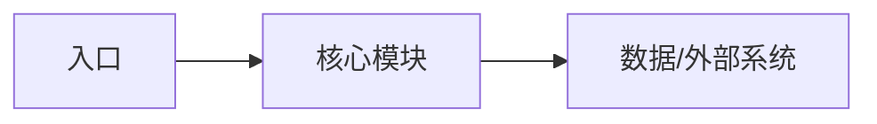

# <功能名>

> 最后核对：<commit / 日期>
> 代码入口：`path/to/entry`

## 1. 功能定位

- 解决的问题：
- 核心边界：
- 不负责：
- 关联系统：

## 2. 实现框架

| 模块/路径 | 稳定责任 | 何时需要阅读 |
|---|---|---|

## 3. 核心数据、状态与不变量

- 数据所有权：
- 生命周期/状态：
- 不能破坏的不变量：

## 4. 配置与集成点

- 配置源：
- 公共接口/协议/事件：
- 兼容与发布约束：

## 5. 关键决策与原因

- 决策：
  - 原因：
  - 修改时注意：

## 6. 坑点与失败处理

- 坑点：
  - 触发：
  - 处理原则：
  - 排查入口：

## 7. 验证与调试导航

- 关键测试：
- 最小验证命令：
- 日志/指标：
- 推荐阅读顺序：
