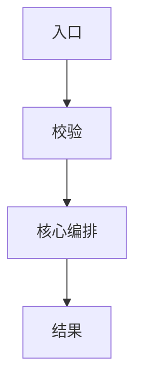

# <功能名>：框架实现方案

> 状态：方案中 / 待确认 / 实现中 / 骨架已完成
> 基线提交：
> 最后更新：

## 1. 框架结论

- 功能归属：
- 核心边界：
- 本阶段完成：
- 延期到完整实现：

## 2. 模块与责任

| 模块/组件 | 责任 | 输入/输出 | 修改类型 |
|---|---|---|---|

## 3. 核心数据结构与不变量

| 数据/状态 | 所有者 | 生命周期 | 关键字段 | 不变量 |
|---|---|---|---|---|

## 4. 主流程

## 5. 配置与接口连接

- 配置来源：
- 公共接口/事件/协议：
- 兼容要求：

## 6. 安全的未完成边界

| 延期内容 | 当前行为 | 副作用保护 | 后续落点 |
|---|---|---|---|

## 7. 用户确认

- 确认结论：
- 修订项：

## 8. 实际实现与偏差

- 已完成：
- 与方案偏差：
- 待完整实现：

## 9. 验证

- 构建/启动：
- 配置加载：
- 入口安全：
- 既有功能 smoke test：
